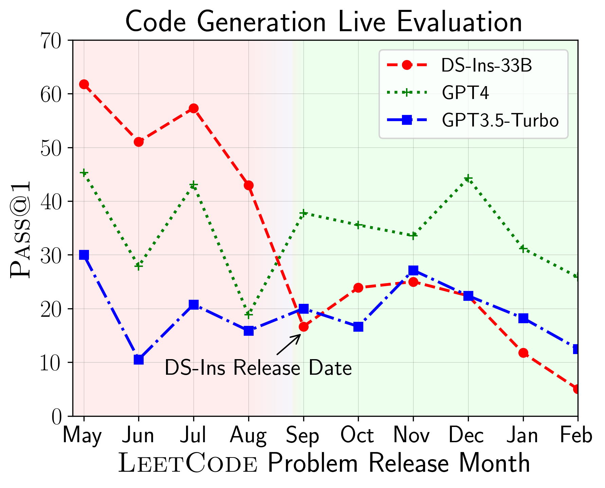
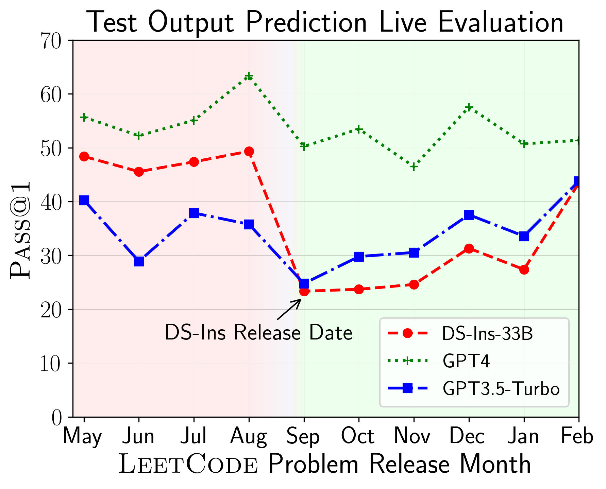
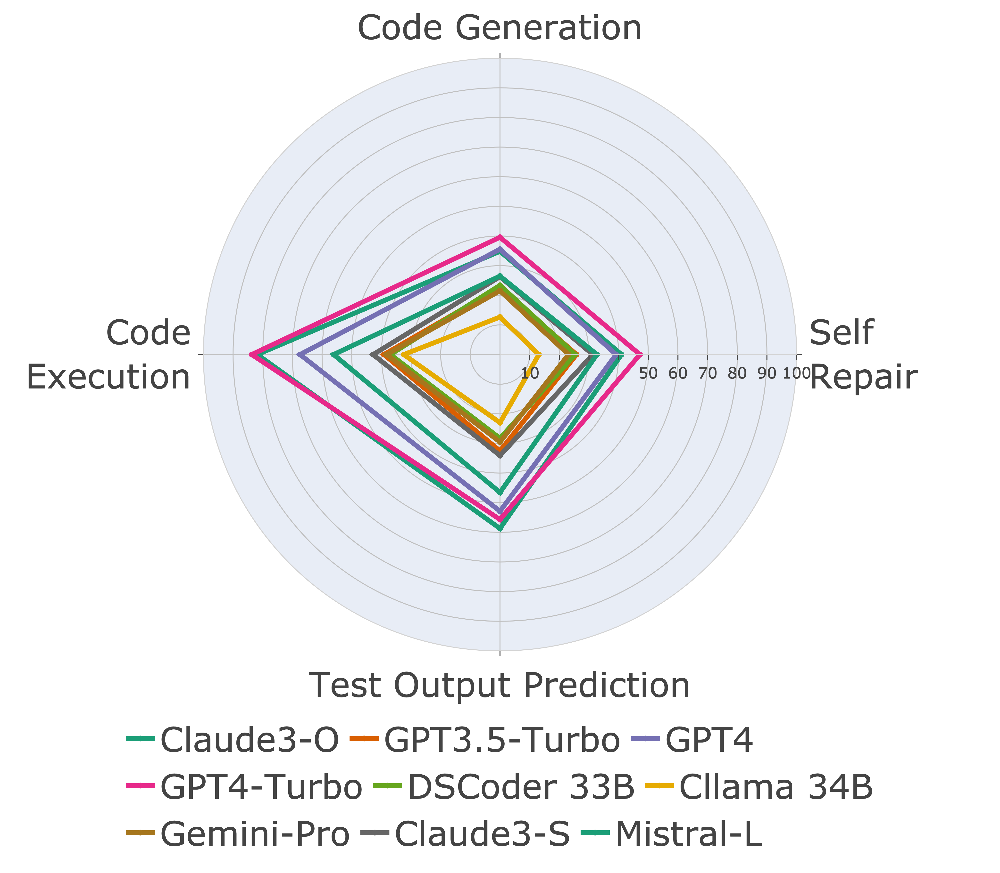
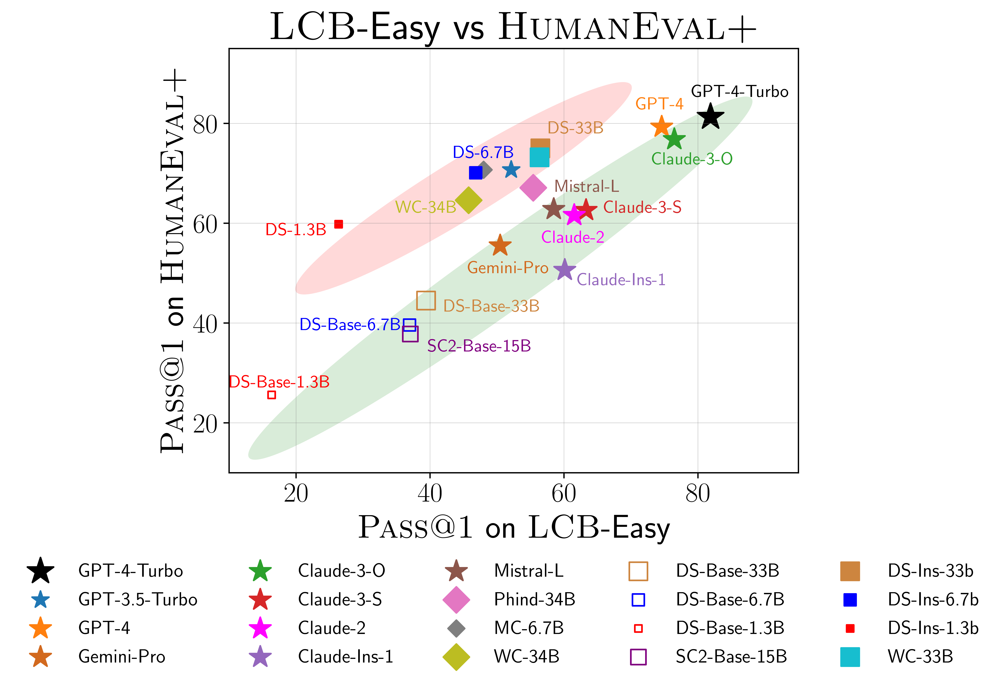

# LiveCodeBench
Official repository for the paper "LiveCodeBench: Holistic and Contamination Free Evaluation of Large Language Models for Code"

<p align="center">
    <a href="https://livecodebench.github.io/">🏠 Home Page</a> •
    <a href="https://huggingface.co/livecodebench/">💻 Data </a> •
    <a href="https://livecodebench.github.io/leaderboard.html">🏆 Leaderboard</a> •
    <a href="https://livecodebench.github.io/leaderboard.html](https://huggingface.co/spaces/livecodebench/code_generation_samples">🔍 Explorer</a> 
</p>

## Introduction
LiveCodeBench provides holistic and contamination-free evaluation of coding capabilities of LLMs.  Particularly, LiveCodeBench continuously collects new problems over time from contests across three competition platforms -- LeetCode, AtCoder, and CodeForces. Next, LiveCodeBench also focuses on a broader range of code-related capabilities, such as self-repair, code execution, and test output prediction, beyond just code generation. Currently, LiveCodeBench hosts four hundred high-quality coding problems that were published between May 2023 and March 2024.


## Installation
You can clone the repository using the following command:

```bash
git clone https://github.com/LiveCodeBench/LiveCodeBench.git
cd LiveCodeBench
```

We recommend using [uv](https://github.com/astral-sh/uv)
for managing dependencies, which can be installed a [number of ways](https://github.com/astral-sh/uv?tab=readme-ov-file#installation).

Verify that `uv` is installed on your system by running:

```bash
uv --version
```

Once `uv` has been installed, use it to create a virtual environment for
LiveCodeBench and install its dependencies with the following commands:

```bash
uv venv --python 3.11
source .venv/bin/activate

uv pip install -e .
```

## Data
We provide a benchmark for different code capability scenarios
- [Code Generation](https://huggingface.co/datasets/livecodebench/code_generation_lite)
- [Code Execution](https://huggingface.co/datasets/livecodebench/execution)
- [Test Output Prediction](https://huggingface.co/datasets/livecodebench/test_generation)

## Inference and Evaluation

### Dataset Versions
Since LiveCodeBench is a continuously updated benchmark, we provide different versions of the dataset. Particularly, we provide the following versions of the dataset:
- `release_v1`: The initial release of the dataset with problems released between May 2023 and Mar 2024 containing 400 problems.
- `release_v2`: The updated release of the dataset with problems released between May 2023 and May 2024 containing 511 problems.
- `release_v3`: The updated release of the dataset with problems released between May 2023 and Jul 2024 containing 612 problems.
- `release_v4`: The updated release of the dataset with problems released between May 2023 and Sep 2024 containing 713 problems.
- `release_v5`: The updated release of the dataset with problems released between May 2023 and Jan 2025 containing 880 problems.
- `release_v6`: The updated release of the dataset with problems released between May 2023 and Apr 2025 containing 1055 problems.

You can use the `--release_version` flag to specify the dataset version you wish to use. Particularly, you can use the following command to run the evaluation on the `release_v2` dataset. Release version defaults to `release_latest`. Additionally, we have introduced fine-grained release versions such as `v1`, `v2`, `v1_v3`, `v4_v5` for specific versions of the dataset.

```bash
python -m lcb_runner.runner.main --model {model_name} --scenario codegeneration --evaluate --release_version release_v2
```

### Code Generation

We use `vllm` for inference using open models. By default, we use  `tensor_parallel_size=${num_gpus}` to parallelize inference across all available GPUs. It can be configured using the  `--tensor_parallel_size` flag as required. 

For running the inference, please provide the `model_name` based on the [./lcb_runner/lm_styles.py](./lcb_runner/lm_styles.py) file.
The scenario (here `codegeneration`) can be used to specify the scenario for the model.

```bash
python -m lcb_runner.runner.main --model {model_name} --scenario codegeneration
```

Additionally, `--use_cache` flag can be used to cache the generated outputs and `--continue_existing` flag can be used to use the existing dumped results. In case you wish to use model from a local path, you can additionally provide `--local_model_path` flag with the path to the model. We use `n=10` and `temperature=0.2` for generation. Please check the [./lcb_runner/runner/parser.py](./lcb_runner/runner/parser.py) file for more details on the flags.

For closed API models,  `--multiprocess` flag can be used to parallelize queries to API servers (adjustable according to rate limits).


#### Evaluation
We compute `pass@1` and `pass@5` metrics for model evaluations.
We use a modified version of the checker released with the [`apps` benchmark](https://github.com/hendrycks/apps/blob/main/eval/testing_util.py) to compute the metrics. Particularly, we identified some unhandled edge cases in the original checker and fixed them and additionally simplified the checker based on our collected dataset. To run the evaluation, you can add the `--evaluate` flag:


```bash
python -m lcb_runner.runner.main --model {model_name} --scenario codegeneration --evaluate
```

Note that time limits can cause slight (`< 0.5`) points of variation in the computation of the `pass@1` and `pass@5` metrics.
If you observe a significant variation in performance, adjust the `--num_process_evaluate` flag to a lower value or increase the `--timeout` flag. Please report particular issues caused by improper timeouts here. 

Finally, to get scores over different time windows, you can use [./lcb_runner/evaluation/compute_scores.py](./lcb_runner/evaluation/compute_scores.py) file. 
Particularly, you can provide `--start_date` and `--end_date` flags (using the `YYYY-MM-DD` format) to get scores over the specified time window. In our paper, to counter contamination in the DeepSeek models, we only report results on problems released after August 2023. You can replicate those evaluations using:

```bash
python -m lcb_runner.evaluation.compute_scores --eval_all_file {saved_eval_all_file} --start_date 2023-09-01
```

**NOTE: We have pruned a large number of test cases from the original benchmark and created `code_generation_lite` which is set as the default benchmark offering similar performance estimation much faster. If you wish to use the original benchmark, please use the `--not_fast` flag. We are in the process of updating the leaderboard scores with this updated setting.** 

**NOTE: V2 Update: to run the update LiveCodeBench please use `--release_version release_v2`. In addition, if you have existing results from `release_v1` you can add `--continue_existing` or better `--continue_existing_with_eval` flags to reuse the old completions or evaluations respectively.**


### Self Repair
For running self repair, you need to provide an additional `--codegen_n` flag that maps to the number of codes that were generated during code generation. Additionally, the `--temperature` flag is used to resolve the old code generation eval file which must be present in the `output` directory. 

```bash
python -m lcb_runner.runner.main --model {model_name --scenario selfrepair --codegen_n {num_codes_codegen} --n 1 # only n=1 supported
```

In case you have results on a smaller subset or version of the benchmark, you can use `--continue_existing` and `--continue_existing_with_eval` flags to reuse the old computations. Particularly, you can run the following command to continue from existing generated solutions.

```bash
python -m lcb_runner.runner.main --model {model_name} --scenario selfrepair --evaluate --continue_existing
```

Note that this will only reuse the generated samples and rerun evaluations. To reuse the old evaluations, you can add the `--continue_existing_with_eval` flag.

### Test Output Prediction
For running the test output prediction scenario you can simply run

```bash
python -m lcb_runner.runner.main --model {model_name} --scenario testoutputprediction --evaluate
```

### Code Execution
For running the test output prediction scenario you can simply run

```bash
python -m lcb_runner.runner.main --model {model_name} --scenario codeexecution --evaluate
```

Additionally, we support the COT setting with

```bash
python -m lcb_runner.runner.main --model {model_name} --scenario codeexecution --cot_code_execution --evaluate
```

## Custom Evaluation
Alternatively, you can using [`lcb_runner/runner/custom_evaluator.py`](./lcb_runner/runner/custom_evaluator.py) to directly evaluated model generations in a custom file. The file should contain a list of model outputs, appropriately formatted for evaluation in the order of benchmark problems. 

```bash
python -m lcb_runner.runner.custom_evaluator --custom_output_file {path_to_custom_outputs}
```

Particularly, arrange the outputs in the following format

```json
[
    {"question_id": "id1", "code_list": ["code1", "code2"]},
    {"question_id": "id2", "code_list": ["code1", "code2"]}
]
```


## Adding Support for New Models

To add support for new models, we have implemented an extensible framework to add new models and customize prompts appropriately. 

Step 1: Add a new model to the [./lcb_runner/lm_styles.py](./lcb_runner/lm_styles.py) file. Particularly, extend the `LMStyle` class to add a new model family and extend the model to the `LanguageModelList` array.

Step 2: Since we use instruction tuned models, we allow configuring the instruction for each model. Modify the [./lcb_runner/prompts/generation.py](./lcb_runner/prompts/generation.py) file to add a new prompt for the model in the `format_prompt_generation` function. 
For example, the prompt for `DeepSeekCodeInstruct` family of models looks as follows

```python
# ./lcb_runner/prompts/generation.py
if LanguageModelStyle == LMStyle.DeepSeekCodeInstruct:
    prompt = f"{PromptConstants.SYSTEM_MESSAGE_DEEPSEEK}\n\n"
    prompt += f"{get_deepseekcode_question_template_answer(question)}"
    return prompt
```

## Submit Models to Leaderboard
We are currently only accepting submissions for only the code generation scenario. To submit models you can create a pull request on our [submissions](https://github.com/LiveCodeBench/submissions). Particularly, you can copy your model generations folder from `output` to the `submissions` folder and create a pull request. We will review the submission and add the model to the leaderboard accordingly. 

## ERRATA
We maintain a list of known issues and updates in the [ERRATA.md](./ERRATA.md) file. Particularly, we document issues regarding erroneous tests and problems not amenable to autograding. We are constantly using this feedback to improve our problem selection heuristics as we update LiveCodeBench.

## Results
LiveCodeBench can be used to evaluate performance of LLMs on different time-windows (using problem release date to filter the models). 
Thus we can detect and prevent potential contamination in the evaluation process and evaluate LLMs on _new_ problems.

<div style="text-align: center;">
    
    
</div>

Next, we evaluate models on different code capabilities and find that relative performances of models do change over tasks (left). 
Thus, it highlights the need for holistic evaluation of LLMs for code.

<div style="text-align: center;">
    
    
</div>

We also find evidence of possible overfitting on HumanEval (right). 
Particularly, models that perform well on HumanEval do not necessarily perform well on LiveCodeBench. 
In the scatterplot above, we find the models get clustered into two groups, shaded in red and green. 
The red group contains models that perform well on HumanEval but poorly on LiveCodeBench, while the green group contains models that perform well on both.

For more details, please refer to our website at [livecodebench.github.io](https://livecodebench.github.io).

## Citation

```bibtex
@article{jain2024livecodebench,
  author    = {Naman Jain, King Han, Alex Gu, Wen-Ding Li, Fanjia Yan, Tianjun Zhang, Sida Wang, Armando Solar-Lezama, Koushik Sen, Ion Stoica},
  title     = {LiveCodeBench: Holistic and Contamination Free Evaluation of Large Language Models for Code},
  year      = {2024},
  journal   = {arXiv preprint},
}
```
